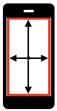

## Simple Screen swipe

Swipe has start and end points. The start point of swipe is most
important. Following elements may prevent swipe start:
- application interface/menu e.g. header or footer
- elements that waiting tap and do not pass touch to scroll view

It is better to start swipe actions at the center of the screen to make
them more reliable.



```java
/**
 * Performs swipe from the center of screen
 *
 * @param dir the direction of swipe
 * @version java-client: 7.3.0
 **/
public void swipeScreen(Direction dir) {
    System.out.println("swipeScreen(): dir: '" + dir + "'"); // always log your actions

    // Animation default time:
    //  - Android: 300 ms
    //  - iOS: 200 ms
    // final value depends on your app and could be greater
    final int ANIMATION_TIME = 200; // ms

    final int PRESS_TIME = 200; // ms

    int edgeBorder = 10; // better avoid edges
    PointOption pointOptionStart, pointOptionEnd;

    // init screen variables
    Dimension dims = driver.manage().window().getSize();

    // init start point = center of screen
    pointOptionStart = PointOption.point(dims.width / 2, dims.height / 2);

    switch (dir) {
        case DOWN: // center of footer
            pointOptionEnd = PointOption.point(dims.width / 2, dims.height - edgeBorder);
            break;
        case UP: // center of header
            pointOptionEnd = PointOption.point(dims.width / 2, edgeBorder);
            break;
        case LEFT: // center of left side
            pointOptionEnd = PointOption.point(edgeBorder, dims.height / 2);
            break;
        case RIGHT: // center of right side
            pointOptionEnd = PointOption.point(dims.width - edgeBorder, dims.height / 2);
            break;
        default:
            throw new IllegalArgumentException("swipeScreen(): dir: '" + dir + "' NOT supported");
    }

    // execute swipe using TouchAction
    try {
        new TouchAction(driver)
                .press(pointOptionStart)
                // a bit more reliable when we add small wait
                .waitAction(WaitOptions.waitOptions(Duration.ofMillis(PRESS_TIME)))
                .moveTo(pointOptionEnd)
                .release().perform();
    } catch (Exception e) {
        System.err.println("swipeScreen(): TouchAction FAILED\n" + e.getMessage());
        return;
    }

    // always allow swipe action to complete
    try {
        Thread.sleep(ANIMATION_TIME);
    } catch (InterruptedException e) {
        // ignore
    }
}

public enum Direction {
    UP,
    DOWN,
    LEFT,
    RIGHT;
}
```


